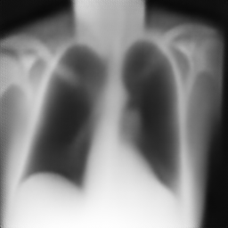
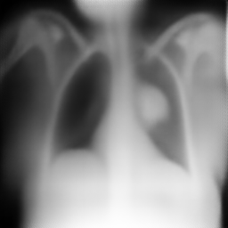
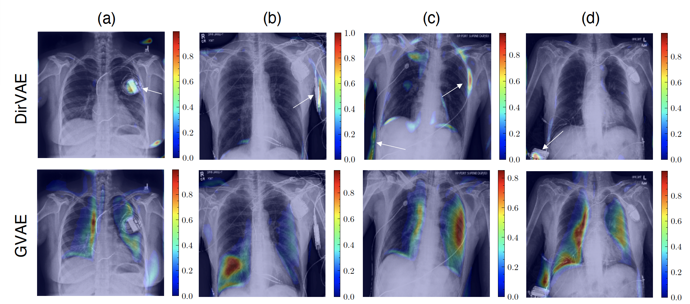

# Disentangled Latent Representations for Chest X-ray Images with Dirichlet Variational Autoencoder (DirVAE)

This repository contains the code and materials for the paper titled "Disentangled Latent Representations for Chest X-ray Images with Dirichlet Variational Autoencoder (DirVAE)." This study explores the use of the Dirichlet Variational Autoencoder (DirVAE) to learn disentangled latent representations of chest X-ray (CXR) images.

## Overview

Our research focuses on using the Dirichlet Variational Autoencoder (DirVAE) for multi-label classification of chest X-ray (CXR) images. The primary objectives and findings of our study include:

- Exploring the use of the Dirichlet prior to encourage disentangled feature learning in CXR image data.
- Training DirVAE models using the CheXpert database.
- Investigating the predictive capacity of multi-modal latent representations learned by DirVAE models.
- Comparing the performance of DirVAE with a standard Gaussian prior-VAE (GVAE).

## Paper Details

- **Title**: Learning disentangled representations for explainable chest X-ray classification using Dirichlet VAEs
- **Authors**: Rachael Harkness, Alejandro F Frangi, Kieran Zucker, Nishant Ravikumar
- **Paper Link**: [https://arxiv.org/abs/2302.02979]()

## Repository Contents

- **`code/`**: Contains the code for training and evaluating the DirVAE models.
- **`results/`**: Directory of the model checkpoints, visual examples, and results.
- **`README.md`**: You are here.

## Getting Started

To get started with this repository, follow these steps:

1. Clone the repository to your local machine.
2. Set up your Python environment with the required dependencies (list them in a `requirements.txt` file).
3. Download and prepare the CheXpert dataset (not included in this repository but available here: [https://stanfordaimi.azurewebsites.net/datasets/]()).
4. Train the DirVAE models using `main.py`.

## Results

We show that when applied to the trained DirVAE, our explainability approach, termed gradient-guided traversals, is able to highlight regions in CXR images that are clinically relevant to the class(es) of interest and additionally, can identify cases where classification relies on spurious feature correlations

											

Our findings and results are detailed in the paper. You can also find trained model checkpoints and visual examples in the `results/` directory. For more details, refer to the paper.

## Contact Information

For questions or feedback, please contact Rachael Harkness at scrha@leeds.ac.uk.
